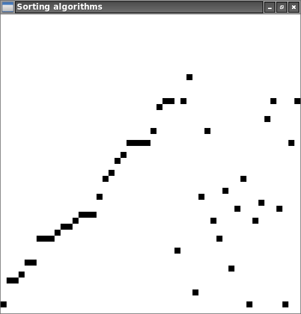

# sorting-algorithms

[](https://travis-ci.org/jean553/sorting-algorithms)



Sorting algorithms implementations.

## Installation and usage

```
cargo run [algorithm]
```

`algorithm` can be equal to:
 * `insertion`: insertion sort
 * `selection`: selection sort
 * `bubble`: bubble sort

Use 'Space' key to iterate and sort step by step.

## Generate documentation

```
cargo rustdoc -- --no-defaults
```

## Sorting algorithms

This project contains the implementations of:
 * the insertion sort
 * the selection sort
 * the merge sort (separated project here [merge-sort](https://github.com/jean553/merge-sort))
 * the quick sort (separated project here [quick-sort](https://github.com/jean553/quick-sort))
 * the bubble sort

### Insertion sort

#### Example

Simple sorting algorithm that sort each item one by one,
taking each item of the array in their initial order.

For example:

```
7 4 3 5
```

Take `7`. This is the first item of the array, so it does nothing.

Take `4`. Check in the list before `4` if this item position has to be changed.
`4` < `7`, so `7` is moved to the right,
there is no item anymore on the left side, so the correct position is assigned to `4`.

The array is now:

```
4 7 3 5
```

Take `3`. Check in the list before `3` if this item position has to be changed.
`3` < `7`, so `7` is moved to the right,
`3` < `4`, so `4` is moved to the right,
there is no item anymore on the left side, so the correct position is assigned to `3`.

The array is now:

```
3 4 7 5
```

Take `5`. Check in the list before `5` is this item position has to be changed.
`5` < `7`, so `7` is moved to the right,
`5` > `4`, so the correct position is assigned to `5`.

The final array is:

```
3 4 5 7
```

#### Complexity, worst case, best case

Best case (array already sorted): `O(n)`, each item is iterated once one by one.

Worst case (array sorted but inverted): `O(n^2)`, each item is iterated once one by one,
but all the items on the left side of the current iterated one have to be moved to the right,
at every iteration.

Average: Quadratic.

#### Pros and cons

Pros: very small array (might be faster than `quicksort`).
Cons: inappropriate for very big arrays.

### Selection sort

#### Example

The selection sort browses the array multiple time in order to find the unsorted minimum value.
Each time this minimum value is find, it is inverted with the current searched index.

For example:

```
7 4 3 5
```

The current index is `0`. The value of the index is `7`. The current minimum value is `7`.

We move the index to the right. The current index is `1`, the value is `4`.
`4` < `7`, so the current minimum value is `4`.

We move the index to the right. The current index is `2`, the value is `3`.
`3` < `4`, so the current minimum value is `3`.

We move the index to the right. The current index is `3`, the value is `5`.
`5` > `3`, so the minimum value is still `3`.

The array has been browsed. The found minimum value is `3` for the current index `0`,
the values `3` and `7` are inverted.

The array is now:

```
3 4 7 5
```

The current index is `1`. The value of the index is `4`. The current minimum value is `4`.

We move the index to the right. The current index is `2`, the value is `7`.
`7` > `4`, so the minimum value is still `4`.

We move the index to the right. The current index is `3`, the value is `5`.
`5` > `4`, so the minimum value is still `4`.

The array has been browsed. The found minimum value is `4` for the current index `1`.

The array is now:

```
3 4 7 5
```

The current index is `2`. The value of the index is `7`. The current minimum value is `7`.

We move the index to the right. The current index is `3`, the value is `5`.
`5` < `7`, so the current minimum value is `5`.

The array has been browsed. The found minimum value is `5` for the current index `2`,
the values `5` and `7` are inverted.

The array is now:

```
3 4 5 7
```

### Merge sort

A merge sort consists of a division of an array into smaller arrays.
This division is applied recursively until each sub-array contains exactly 1 or 2 items.
The items are ordered. Each sub-array is then merged with each other.
The merge sort is a `divide and conquer` algorithm.

### Bubble sort

The bubble sort is one of the worstest sorting algorithms.
It iterates on every item one by one and inverts it with the item just before if the two items are not ordered to each other.
The algorithm browses the whole array multiple times as long as all the items are ordered.
